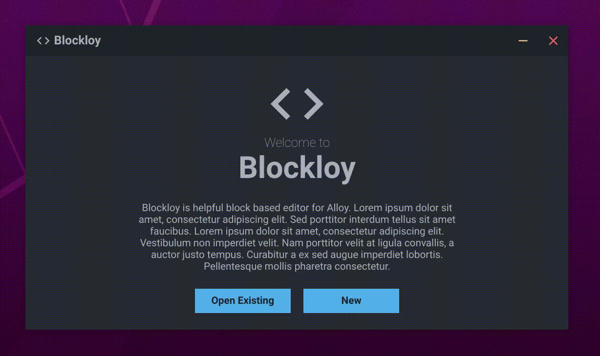

# blockloy

Blockloy is a block based code editor for alloy.

### Screenshot
Here is a screenshot of the latest home screen:

### About
This is all written in Typescript. This application is built with electron. The render process
uses React and SCSS.

### Test
To run locally:
1. Clone this repo and navigate to both `/main` and `/render` and run `npm install` in each.
1. Start the render process by navigating to `/render` and calling `npm run start`.
1. Start the main process by navigating to `/main` and compile with `npm run compile` and
then starting by `npm run start`.